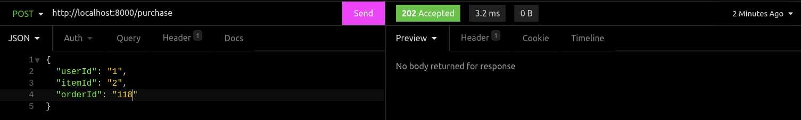
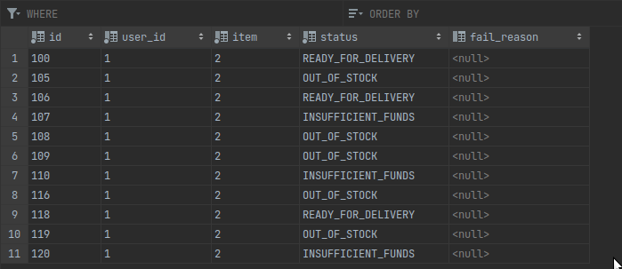

## Implementation of Saga in Java

### Technology stack:
1. Java 21
2. Kafka client
3. Redpanda
4. Postgres
5. Spring JDBC
6. Docker/docker-compose
7. JUnit 5 / Mockito / AssertJ

### Testing result:

1. Happy path


### Logs:
```shell
orders-service_1     | 13:04:13.151 [reactor-http-epoll-2] INFO  com.intellias.OrdersServiceMain - New purchase request = PurchaseCommand[orderId=118, userId=1, itemId=2]
orders-service_1     | 13:04:13.153 [reactor-http-epoll-2] INFO  c.i.e.p.impl.KafkaEventPublisher - Event {"eventType":"PREPARE_ORDER","payload":{"orderId":"118","userId":"1","itemId":"2"}} sent to topic orders-service-requests. Metadata = orders-service-requests-0@17
orders-service_1     | 13:04:13.162 [Thread-1] INFO  c.i.consumer.KafkaEventListener - Processing new batch of events
orders-service_1     | 13:04:13.162 [Thread-1] INFO  c.i.consumer.KafkaEventListener - Processing record ConsumerRecord(topic = orders-service-requests, partition = 0, leaderEpoch = 9, offset = 17, CreateTime = 1711717453151, serialized key size = 3, serialized value size = 83, headers = RecordHeaders(headers = [], isReadOnly = false), key = 118, value = {"eventType":"PREPARE_ORDER","payload":{"orderId":"118","userId":"1","itemId":"2"}})
orders-service_1     | 13:04:13.162 [Thread-1] INFO  c.i.e.PrepareOrderEventHandler - Preparing order 118 for user 1 and item 2
orders-service_1     | 13:04:13.164 [Thread-1] INFO  c.i.e.PrepareOrderEventHandler - Trying to reserve item = 2...
orders-service_1     | 13:04:13.166 [Thread-1] INFO  c.i.e.p.impl.KafkaEventPublisher - Event {"eventType":"RESERVE_ITEM","payload":{"itemId":"2","orderId":"118"}} sent to topic item-service-requests. Metadata = item-service-requests-0@19
items-service_1      | 13:04:13.172 [main] INFO  c.i.consumer.KafkaEventListener - Processing new batch of events
items-service_1      | 13:04:13.172 [main] INFO  c.i.consumer.KafkaEventListener - Processing record ConsumerRecord(topic = item-service-requests, partition = 0, leaderEpoch = 17, offset = 19, CreateTime = 1711717453164, serialized key size = 1, serialized value size = 69, headers = RecordHeaders(headers = [], isReadOnly = false), key = 2, value = {"eventType":"RESERVE_ITEM","payload":{"itemId":"2","orderId":"118"}})
items-service_1      | 13:04:13.172 [main] INFO  c.i.e.ReserveItemEventHandler - Trying to reserve item 2 for order 118
items-service_1      | 13:04:13.172 [main] INFO  c.i.s.i.ItemReservationsServiceImpl - Attempting to reserve item 2 for order 118
items-service_1      | 13:04:13.173 [main] INFO  c.i.s.i.ItemReservationsServiceImpl - Found item details ItemDetails[price=400, quantity=5] by id = 2
items-service_1      | 13:04:13.179 [main] INFO  c.i.e.ReserveItemEventHandler - Reservation result = ItemReservationResult[status=RESERVED, currentPrice=400]
items-service_1      | 13:04:13.179 [main] INFO  c.i.e.ReserveItemEventHandler - Reserved or was already reserved
items-service_1      | 13:04:13.182 [main] INFO  c.i.e.p.impl.KafkaEventPublisher - Event {"eventType":"ITEM_RESERVED","payload":{"orderId":"118","price":400}} sent to topic item-service-responses. Metadata = item-service-responses-0@11
orders-service_1     | 13:04:13.183 [Thread-1] INFO  c.i.consumer.KafkaEventListener - Processing new batch of events
orders-service_1     | 13:04:13.183 [Thread-1] INFO  c.i.consumer.KafkaEventListener - Processing record ConsumerRecord(topic = item-service-responses, partition = 0, leaderEpoch = 10, offset = 11, CreateTime = 1711717453180, serialized key size = 3, serialized value size = 69, headers = RecordHeaders(headers = [], isReadOnly = false), key = 118, value = {"eventType":"ITEM_RESERVED","payload":{"orderId":"118","price":400}})
orders-service_1     | 13:04:13.185 [Thread-1] INFO  c.i.e.ItemForOrderReservedEventHandler - Item reservation for order 118 at price = 400.0 was successful!
orders-service_1     | 13:04:13.189 [Thread-1] INFO  c.i.e.ItemForOrderReservedEventHandler - Requesting payment of amount = 400.0 from user 1 for order 118
orders-service_1     | 13:04:13.192 [Thread-1] INFO  c.i.e.p.impl.KafkaEventPublisher - Event {"eventType":"WITHDRAW_MONEY_FOR_ORDER","payload":{"userId":"1","orderId":"118","amount":400.0}} sent to topic user-service-requests. Metadata = user-service-requests-0@7
users-service_1      | 13:04:13.208 [main] INFO  c.i.consumer.KafkaEventListener - Processing new batch of events
users-service_1      | 13:04:13.208 [main] INFO  c.i.consumer.KafkaEventListener - Processing record ConsumerRecord(topic = user-service-requests, partition = 0, leaderEpoch = 12, offset = 7, CreateTime = 1711717453190, serialized key size = 1, serialized value size = 96, headers = RecordHeaders(headers = [], isReadOnly = false), key = 1, value = {"eventType":"WITHDRAW_MONEY_FOR_ORDER","payload":{"userId":"1","orderId":"118","amount":400.0}})
users-service_1      | 13:04:13.218 [main] INFO  c.i.e.WithdrawMoneyForOrderEventHandler - Trying to withdrawn amount = 400.0 from user 1 for order = 118
users-service_1      | 13:04:13.218 [main] INFO  c.i.s.impl.OrderPaymentServiceImpl - Paying for order 118 user = 1 amount = 400.0
users-service_1      | 13:04:13.257 [main] INFO  c.i.s.impl.OrderPaymentServiceImpl - Balance of user 1 updated and transaction was created!
users-service_1      | 13:04:13.258 [main] INFO  c.i.e.WithdrawMoneyForOrderEventHandler - Transaction execution result = MONEY_WITHDRAWN
users-service_1      | 13:04:13.270 [main] INFO  c.i.e.p.impl.KafkaEventPublisher - Event {"eventType":"WITHDRAW_MONEY_FOR_ORDER_SUCCEEDED","payload":{"orderId":"118"}} sent to topic user-service-responses. Metadata = user-service-responses-0@5
orders-service_1     | 13:04:13.274 [Thread-1] INFO  c.i.consumer.KafkaEventListener - Processing new batch of events
orders-service_1     | 13:04:13.274 [Thread-1] INFO  c.i.consumer.KafkaEventListener - Processing record ConsumerRecord(topic = user-service-responses, partition = 0, leaderEpoch = 10, offset = 5, CreateTime = 1711717453261, serialized key size = 3, serialized value size = 78, headers = RecordHeaders(headers = [], isReadOnly = false), key = 118, value = {"eventType":"WITHDRAW_MONEY_FOR_ORDER_SUCCEEDED","payload":{"orderId":"118"}})
orders-service_1     | 13:04:13.275 [Thread-1] INFO  c.i.e.MoneyForOrderWithdrawnEventHandler - Money for order 118 were withdrawn! Order is ready for delivery!
```

2. Item out of stock

Logs:
```shell
orders-service_1     | 13:08:01.314 [reactor-http-epoll-3] INFO  com.intellias.OrdersServiceMain - New purchase request = PurchaseCommand[orderId=119, userId=1, itemId=2]
orders-service_1     | 13:08:01.317 [reactor-http-epoll-3] INFO  c.i.e.p.impl.KafkaEventPublisher - Event {"eventType":"PREPARE_ORDER","payload":{"orderId":"119","userId":"1","itemId":"2"}} sent to topic orders-service-requests. Metadata = orders-service-requests-0@18
orders-service_1     | 13:08:01.323 [Thread-1] INFO  c.i.consumer.KafkaEventListener - Processing new batch of events
orders-service_1     | 13:08:01.323 [Thread-1] INFO  c.i.consumer.KafkaEventListener - Processing record ConsumerRecord(topic = orders-service-requests, partition = 0, leaderEpoch = 9, offset = 18, CreateTime = 1711717681314, serialized key size = 3, serialized value size = 83, headers = RecordHeaders(headers = [], isReadOnly = false), key = 119, value = {"eventType":"PREPARE_ORDER","payload":{"orderId":"119","userId":"1","itemId":"2"}})
orders-service_1     | 13:08:01.324 [Thread-1] INFO  c.i.e.PrepareOrderEventHandler - Preparing order 119 for user 1 and item 2
orders-service_1     | 13:08:01.326 [Thread-1] INFO  c.i.e.PrepareOrderEventHandler - Trying to reserve item = 2...
orders-service_1     | 13:08:01.328 [Thread-1] INFO  c.i.e.p.impl.KafkaEventPublisher - Event {"eventType":"RESERVE_ITEM","payload":{"itemId":"2","orderId":"119"}} sent to topic item-service-requests. Metadata = item-service-requests-0@20
items-service_1      | 13:08:01.333 [main] INFO  c.i.consumer.KafkaEventListener - Processing new batch of events
items-service_1      | 13:08:01.333 [main] INFO  c.i.consumer.KafkaEventListener - Processing record ConsumerRecord(topic = item-service-requests, partition = 0, leaderEpoch = 17, offset = 20, CreateTime = 1711717681326, serialized key size = 1, serialized value size = 69, headers = RecordHeaders(headers = [], isReadOnly = false), key = 2, value = {"eventType":"RESERVE_ITEM","payload":{"itemId":"2","orderId":"119"}})
items-service_1      | 13:08:01.334 [main] INFO  c.i.e.ReserveItemEventHandler - Trying to reserve item 2 for order 119
items-service_1      | 13:08:01.334 [main] INFO  c.i.s.i.ItemReservationsServiceImpl - Attempting to reserve item 2 for order 119
items-service_1      | 13:08:01.334 [main] INFO  c.i.s.i.ItemReservationsServiceImpl - Found item details ItemDetails[price=400, quantity=0] by id = 2
items-service_1      | 13:08:01.335 [main] INFO  c.i.e.ReserveItemEventHandler - Reservation result = ItemReservationResult[status=OUT_OF_STOCK, currentPrice=400]
items-service_1      | 13:08:01.335 [main] INFO  c.i.e.ReserveItemEventHandler - Item is out of stock...
items-service_1      | 13:08:01.336 [main] INFO  c.i.e.p.impl.KafkaEventPublisher - Event {"eventType":"ITEM_RESERVATION_FAILED","payload":{"orderId":"119"}} sent to topic item-service-responses. Metadata = item-service-responses-0@12
orders-service_1     | 13:08:01.344 [Thread-1] INFO  c.i.consumer.KafkaEventListener - Processing new batch of events
orders-service_1     | 13:08:01.344 [Thread-1] INFO  c.i.consumer.KafkaEventListener - Processing record ConsumerRecord(topic = item-service-responses, partition = 0, leaderEpoch = 10, offset = 12, CreateTime = 1711717681335, serialized key size = 3, serialized value size = 67, headers = RecordHeaders(headers = [], isReadOnly = false), key = 119, value = {"eventType":"ITEM_RESERVATION_FAILED","payload":{"orderId":"119"}})
orders-service_1     | 13:08:01.345 [Thread-1] INFO  c.i.e.ItemForOrderNotReservedEventHandler - Failed to reserve item for order 119
```

3. User doesn't have enough money for order
```shell
orders-service_1     | 13:09:11.575 [reactor-http-epoll-3] INFO  com.intellias.OrdersServiceMain - New purchase request = PurchaseCommand[orderId=120, userId=1, itemId=2]
orders-service_1     | 13:09:11.576 [reactor-http-epoll-3] INFO  c.i.e.p.impl.KafkaEventPublisher - Event {"eventType":"PREPARE_ORDER","payload":{"orderId":"120","userId":"1","itemId":"2"}} sent to topic orders-service-requests. Metadata = orders-service-requests-0@19
orders-service_1     | 13:09:11.580 [Thread-1] INFO  c.i.consumer.KafkaEventListener - Processing new batch of events
orders-service_1     | 13:09:11.580 [Thread-1] INFO  c.i.consumer.KafkaEventListener - Processing record ConsumerRecord(topic = orders-service-requests, partition = 0, leaderEpoch = 9, offset = 19, CreateTime = 1711717751575, serialized key size = 3, serialized value size = 83, headers = RecordHeaders(headers = [], isReadOnly = false), key = 120, value = {"eventType":"PREPARE_ORDER","payload":{"orderId":"120","userId":"1","itemId":"2"}})
orders-service_1     | 13:09:11.581 [Thread-1] INFO  c.i.e.PrepareOrderEventHandler - Preparing order 120 for user 1 and item 2
orders-service_1     | 13:09:11.583 [Thread-1] INFO  c.i.e.PrepareOrderEventHandler - Trying to reserve item = 2...
orders-service_1     | 13:09:11.585 [Thread-1] INFO  c.i.e.p.impl.KafkaEventPublisher - Event {"eventType":"RESERVE_ITEM","payload":{"itemId":"2","orderId":"120"}} sent to topic item-service-requests. Metadata = item-service-requests-0@21
items-service_1      | 13:09:11.590 [main] INFO  c.i.consumer.KafkaEventListener - Processing new batch of events
items-service_1      | 13:09:11.590 [main] INFO  c.i.consumer.KafkaEventListener - Processing record ConsumerRecord(topic = item-service-requests, partition = 0, leaderEpoch = 17, offset = 21, CreateTime = 1711717751584, serialized key size = 1, serialized value size = 69, headers = RecordHeaders(headers = [], isReadOnly = false), key = 2, value = {"eventType":"RESERVE_ITEM","payload":{"itemId":"2","orderId":"120"}})
items-service_1      | 13:09:11.591 [main] INFO  c.i.e.ReserveItemEventHandler - Trying to reserve item 2 for order 120
items-service_1      | 13:09:11.591 [main] INFO  c.i.s.i.ItemReservationsServiceImpl - Attempting to reserve item 2 for order 120
items-service_1      | 13:09:11.591 [main] INFO  c.i.s.i.ItemReservationsServiceImpl - Found item details ItemDetails[price=400, quantity=3] by id = 2
items-service_1      | 13:09:11.593 [main] INFO  c.i.e.ReserveItemEventHandler - Reservation result = ItemReservationResult[status=RESERVED, currentPrice=400]
items-service_1      | 13:09:11.593 [main] INFO  c.i.e.ReserveItemEventHandler - Reserved or was already reserved
items-service_1      | 13:09:11.594 [main] INFO  c.i.e.p.impl.KafkaEventPublisher - Event {"eventType":"ITEM_RESERVED","payload":{"orderId":"120","price":400}} sent to topic item-service-responses. Metadata = item-service-responses-0@13
orders-service_1     | 13:09:11.602 [Thread-1] INFO  c.i.consumer.KafkaEventListener - Processing new batch of events
orders-service_1     | 13:09:11.602 [Thread-1] INFO  c.i.consumer.KafkaEventListener - Processing record ConsumerRecord(topic = item-service-responses, partition = 0, leaderEpoch = 10, offset = 13, CreateTime = 1711717751593, serialized key size = 3, serialized value size = 69, headers = RecordHeaders(headers = [], isReadOnly = false), key = 120, value = {"eventType":"ITEM_RESERVED","payload":{"orderId":"120","price":400}})
orders-service_1     | 13:09:11.602 [Thread-1] INFO  c.i.e.ItemForOrderReservedEventHandler - Item reservation for order 120 at price = 400.0 was successful!
orders-service_1     | 13:09:11.604 [Thread-1] INFO  c.i.e.ItemForOrderReservedEventHandler - Requesting payment of amount = 400.0 from user 1 for order 120
orders-service_1     | 13:09:11.605 [Thread-1] INFO  c.i.e.p.impl.KafkaEventPublisher - Event {"eventType":"WITHDRAW_MONEY_FOR_ORDER","payload":{"userId":"1","orderId":"120","amount":400.0}} sent to topic user-service-requests. Metadata = user-service-requests-0@8
users-service_1      | 13:09:11.611 [main] INFO  c.i.consumer.KafkaEventListener - Processing new batch of events
users-service_1      | 13:09:11.611 [main] INFO  c.i.consumer.KafkaEventListener - Processing record ConsumerRecord(topic = user-service-requests, partition = 0, leaderEpoch = 12, offset = 8, CreateTime = 1711717751604, serialized key size = 1, serialized value size = 96, headers = RecordHeaders(headers = [], isReadOnly = false), key = 1, value = {"eventType":"WITHDRAW_MONEY_FOR_ORDER","payload":{"userId":"1","orderId":"120","amount":400.0}})
users-service_1      | 13:09:11.611 [main] INFO  c.i.e.WithdrawMoneyForOrderEventHandler - Trying to withdrawn amount = 400.0 from user 1 for order = 120
users-service_1      | 13:09:11.611 [main] INFO  c.i.s.impl.OrderPaymentServiceImpl - Paying for order 120 user = 1 amount = 400.0
users-service_1      | 13:09:11.612 [main] INFO  c.i.s.impl.OrderPaymentServiceImpl - User doesn't have enough money. Current balance = 100
users-service_1      | 13:09:11.612 [main] INFO  c.i.e.WithdrawMoneyForOrderEventHandler - Transaction execution result = INSUFFICIENT_FUNDS
users-service_1      | 13:09:11.614 [main] INFO  c.i.e.p.impl.KafkaEventPublisher - Event {"eventType":"WITHDRAW_MONEY_FOR_ORDER_FAILED","payload":{"orderId":"120"}} sent to topic user-service-responses. Metadata = user-service-responses-0@6
orders-service_1     | 13:09:11.622 [Thread-1] INFO  c.i.consumer.KafkaEventListener - Processing new batch of events
```

Orders:
